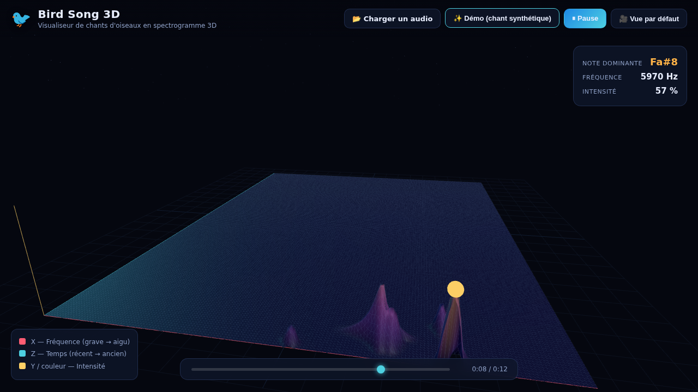

# 🐦 Bird Song 3D

Visualiseur de **chants d'oiseaux en graphique 3D**. On fournit un fichier
audio en entrée et l'application génère un **spectrogramme 3D animé** qui
représente les notes chantées, avec une **dimension de temps** permettant de
visualiser le chant en temps réel pendant la lecture.



## Ce que montre le graphe

L'application affiche une surface 3D « en cascade » (waterfall) qui défile au
rythme du chant :

| Axe | Signification |
|-----|----------------|
| **X** (rouge) | Fréquence / hauteur de la note (grave → aigu, 700 Hz → 11 kHz) |
| **Z** (cyan)  | Temps (la trame la plus récente au premier plan, les anciennes s'éloignent) |
| **Y + couleur** (jaune) | Intensité de la note (haut + clair = fort) |

Une sphère lumineuse suit en direct la **note dominante**, et un panneau
affiche son nom (Do, Ré, Mi…), sa fréquence et son intensité.

## Utilisation

Aucune installation ni compilation. Il suffit de servir le dossier avec un
petit serveur HTTP local (nécessaire pour les modules ES) :

```bash
# depuis la racine du projet
python3 -m http.server 8000
# puis ouvrir http://localhost:8000
```

Ou avec Node :

```bash
npx serve .
```

Ensuite, dans le navigateur :

1. **📂 Charger un audio** — choisissez un fichier (`.mp3`, `.wav`, `.ogg`, …),
   de préférence un enregistrement de chant d'oiseau.
2. **▶︎ Lire** — le spectrogramme 3D se construit en temps réel, synchronisé
   avec la lecture.
3. **✨ Démo** — génère un chant d'oiseau synthétique si vous n'avez pas de
   fichier sous la main.

Contrôles de la caméra : **glisser** pour tourner, **molette** pour zoomer,
**🎥 Vue par défaut** pour recentrer.

## Démo en ligne (GitHub Pages)

Le dépôt inclut un workflow (`.github/workflows/deploy-pages.yml`) qui publie
le site sur GitHub Pages. Une seule action manuelle est nécessaire pour
autoriser Pages (le token du workflow ne peut pas l'activer lui-même) :

**Settings → Pages → Build and deployment → Source : `GitHub Actions`.**

Le workflow se déclenche ensuite à chaque push sur `main` (ou sur la branche de
feature), et peut aussi être lancé à la main via *Actions → Deploy to GitHub
Pages → Run workflow*. Le site est alors disponible à l'adresse
`https://ottoreg.github.io/bird_song/`.

## Fonctionnement technique

- **Web Audio API** (`AnalyserNode`, FFT 4096 points) pour extraire le spectre
  de fréquences en temps réel pendant la lecture.
- Les bins FFT sont regroupés en 160 colonnes sur une **échelle logarithmique**
  ciblée sur la plage vocale des oiseaux (≈ 0,7 – 11 kHz).
- **Three.js** (WebGL) pour le rendu : une `BufferGeometry` en grille dont les
  hauteurs et couleurs des sommets sont mises à jour à chaque trame, avec un
  effet de défilement temporel.
- 100 % côté navigateur, aucun serveur de traitement, aucune donnée envoyée.

## Structure

```
index.html          Page + interface
src/
  main.js           Scène Three.js, mapping fréquentiel, boucle temps réel, UI
  audio.js          Moteur audio (lecture, FFT, synthèse de la démo)
  spectrogram.js    Surface 3D en cascade + marqueur de note dominante
  palette.js        Palette de couleurs (intensité → couleur)
  style.css         Interface
vendor/three/       Three.js hébergé localement (import map)
assets/             Aperçu
```

## Dépendances

[Three.js](https://threejs.org/) `0.160.0` est **inclus dans le dépôt**
(`vendor/three/`) et résolu via une *import map*. Aucune installation, aucune
connexion réseau ni compilation n'est nécessaire — l'application fonctionne
entièrement hors-ligne.
